## Виртуальные машины
---

Развернуто 7 (через техническую поддержку была увеличена квота, по умолчанию 5) виртуальных машин (VM) со следующими характеристиками: **2 CPU / 2 RAM / 20 SSD** кроме Prometheus.

Список VM:

- haproxy - HAProxy;
- pg-01 - PostgreSQL + Patroni;
- pg-02 - PostgreSQL + Patroni;
- etcd-01 - etcd;
- etcd-02 - etcd;
- etcd-03 - etcd;
- prometheus - prometheus - **4 CPU / 4 RAM / 20 SSD**.

Для каждой VM создан снапшот, чтобы можно было тратить меньше времени на ее пересоздание в случае необходимости.

Все VM объединены одной виртуальной сетью.

Правила Firewall для виртуальной сети:

По умолчанию: Reject

Разрешены все протоколы и порты для:

- Home;
- Kubernetes;
- Внутренняя сеть;
- Внешние адреса VM;
- Доступ к Prometheus для всех по авторизации.

У всех VM есть внешний адрес, но так как судя по всему используется NAT 1:1, то Firewall виртуальной сети функционирует и тут.

Внешние адреса используется для того, чтобы попадать на хосты по SSH для возможной отладки и в случае HAProxy, чтобы открыть доступ Kubernetes.


## PostgreSQL / Patroni / etcd / HAProxy
---


### Ansible
- - -

За основу была взята роль Ansible postgresql_cluster из репозитория https://github.com/vitabaks/postgresql_cluster из который удалены хвосты GitHuh, Molecule и файлы Consul.

Роль не подразумевает использования публичных адресов (да и при NAT 1:1 работать не будет, потому что адреса в хостах биндятся на интерфейс), поэтому при запуске инсталляции с ноутбука сперва создается туннель до VM с HAProxy при помощи sshuttle, чтобы получить доступ ко внутренней сети VM.

В роль добавлены:

- Добавление адреса HAProxy через переменную cluster_ip в pg_hba.conf;
- Создание БД в процессе установки и загрузка в нее SQL-дампа: roles/postgresql-databases/ с нужными базами, таблицами, 10 городами и рандомно генерируемыми данными по температуре.

После первой установки необходимо в inventory поменять флаг `postgresql_exists` в true у `хостов` в группах `[master]` и `[replica]`, чтобы не получить ошибку при перенакатке роли.

Адрес со статистикой HAProxy: [Statistics Report for HAProxy](http://haproxy:7000/stats)


## Weather API
---


### Helm
- - -

В Helm Chart добавлен хак с `rollme: {{ randAlphaNum 5 | quote }}` для пересоздания подов после каждого `upgrade`. В Helm Chart созданном через `create` она добавляется в зависимость от `podAnnotations`. Вырезать ее не стал, просто добавил заглушку.

Итоговое приложение находится по адресу:  http://iduniti4uah5ei.local/


### Prometheus / Exporters / Grafana
- - -

Prometheus установлен вручную на отдельной виртуальной машине.

Установлена авторизация по логину/паролю и добавлен самоподписанный сертификат.

Включен `enable-admin-api` для доступ к API для управления данными через `curl`

Storage retention выставлен в 90 дней.

Метрики:

- Prometheus;
- node_exporter;
  - Хосты разделены по группам при помощи меток;
- patroni_exporter;
  - Добавлена метка service_name для отображения селектора и имени в дашборде;
- etcd_exporter;
- postgresql_exporter;
- blackbox_exporter (сам blackbox и его метрики);
- alertmanager (сам alertmanager и его метрики).

Используемые шаблоны Grafana:

- [Node Exporter Full  | Grafana Labs](https://grafana.com/grafana/dashboards/1860-node-exporter-full/)
  - Внесены изменения для корректного отображения групп хостов;
  - На экспортерах включены коллекторы `systemd` и `processes` для корректной работы дашборда;
- [PostgreSQL Patroni | Grafana Labs](https://grafana.com/grafana/dashboards/18870-postgresql-patroni/)
- [Etcd by Prometheus | Grafana Labs](https://grafana.com/grafana/dashboards/3070-etcd/)
  - Немного странный шаблон, либо же я не разобрался, так как сразу в глаза бросилась странная метрика `The total number of failed proposals seen`, которая показывала `1`. Оказалось, что она смотрит на counter `etcd_server_leader_changes_seen_total`. Поменял на `etcd_server_proposals_failed_total`.
- [PostgreSQL Database | Grafana Labs](https://grafana.com/grafana/dashboards/9628-postgresql-database/)
  - datasource ограничен одним источником;
  - Судя по всему дашборд достаточно старый, так как многие счетчики в дашборде не соответствуют своим названиям (например в pg_stat_bgwriter_*, в них добавлен префикс _total);
- [Alertmanager | Grafana Labs](https://grafana.com/grafana/dashboards/9578-alertmanager/)
  - Убраны ненужны графики;
- [Prometheus Blackbox Exporter | Grafana Labs](https://grafana.com/grafana/dashboards/7587-prometheus-blackbox-exporter/)
  - Добавлен график Response Code.
- 4 Golden Signals

Адрес с Prometheus: https://prometheus:9090/

### Ansible
- - -

Для node_exporter была сделана роль prometheus_node_exporter, который устанавливает и запускает node_exporter с авторизацией и коллекторами systemd, processes и filesystem.ignored-mount-points.

Для postgresql_exporter была сделана роль prometheus_postgresql_exporter, который устанавливает и запускает postgresql_exporter с авторизацией и коллектором postmaster.


## НТ
- - -

Используется k6: [grafana/xk6-dashboard: A k6 extension that enables creating web based metrics dashboard for k6](https://github.com/grafana/xk6-dashboard)

### Описание сервиса
- - -

Для примера, предположим, что наш сервис предоставляет сервис погоды для золотого кольца России:

- Сергиев Посад
- Переславль-Залесский
- Ростов Великий
- Углич
- Ярославль
- Кострома
- Иваново
- Суздаль
- Владимир

База заполнена автоматически генерируемыми данными (720 случайных значений) погоды за промежуток в 10 дней от даты генерации.


### Ресурсы сервиса
- - -

В первом разделе «Виртуальные машины» есть список и характеристики всех VM. Backend крутится в Kubernetes и представляет собой Blackbox.

Ресурсы Kubernetes (3 реплики):
```
  limits:
    cpu: 250m
    memory: 128Mi
  requests:
    cpu: 50m
    memory: 64Mi
```

k6 установлен на сервере с Prometheus.

### API сервиса
- - -

Имеется доступ к Swager: [Swagger UI](http://iduniti4uah5ei.local/swagger/index.html)

Есть два высоконагруженных метода GET /Forecast и /WeatherForecast, которые отдают список со всеми городами и значения всех температур в них. Методы практически идентичны друг другу (крохотное отличие в структуре отдаваемого JSON).

Остальные методы:

- Cities
  - GET /Cities - список всех городов
  - GET /Cities/{id} - конкретный город
  - PUT /Cities/{id} - изменить название конкретного города
  - POST /Cities - добавить новый город
- Forecast
  - GET /Forecast/{id} - значение погоды (пригодно разве что для теста, чтобы дергать случайные значения)
  - PUT /Forecast/{id} - изменить конкретную погоду
  - POST /Forecast/{cityId} - добавить новое значение погоды для конкретного города


### Требования  к доступность и производительности
- - -

Будем равняться на доступностью такого монстра как OpenWeather для бесплатного использования. Таким образом пусть у нас внутренние соглашения и обязанности перед клиентами будут равны. Показателем SLI будет время ответа.

Итого:

- SLO/SLA:
  - 90%
    - время ответа (P95) - не более 600ms
    - время ответа (P90) - не более 300ms;
  - не более 1% ошибок (код ответа <> 200-299).
- SLI:
  - время ответа;
  - процент ошибок.

> В секцию thresholds добавлен checks: ['rate>0.9’] для SLO/SLA 90%, так как мы допускаем что другие коллеги будут запускать свои нагрузочные тесты параллельно с нами, а Kubernetes-ресурсы у нас общие. Спустя какое-то время стало понятно, что найти большое свободное окно для нагрузочных тестов очень трудно, так что пришлось убрать из планов прогон с разными ресурсами подов. Лимиты подов на CPU увеличены со 100 до 250, а памяти со 128 до 256. Время прогона тестов тоже пришлось сократить. Количество возрастающих пользователей пришлось увеличить со 100 до 600.


Даже в 2 часа ночи можно наблюдать как чужие тесты грузят ингресс.

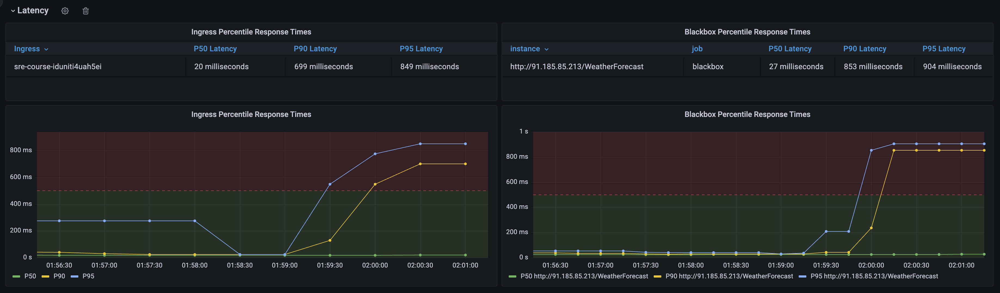


### Профили нагрузки
- - -

Репорты по сценариям лежат в папке **k6/reports/**

#### Сценарий #1
- - -

**main.js**

Клиент получает список городов (9 штук) и дергает информацию по каждому из них по отдельности. Пусть наш API ограничен по скорости принятия запросов от каждого клиента (2r/s). Начинаем вход с 0 пользователей и увеличиваем их количество на 600 каждые 5 минут в течении 5 минут. Задача найти максимальное количество пользователей, которое может выдержать наш сервис при таком сценарии не нарушая SLI.

**Результат**: 
- 1.2k VU;
- 1.17k/s запросов;
- Среднее время ответа: 103ms

Уперлись в CPU подов:

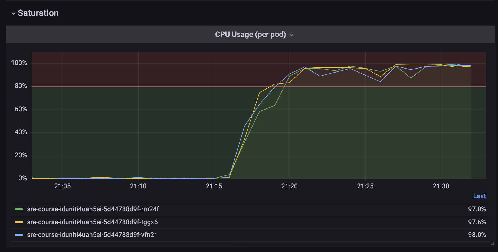

Так же был кратковременный скачок минутного LA PostgreSQL:

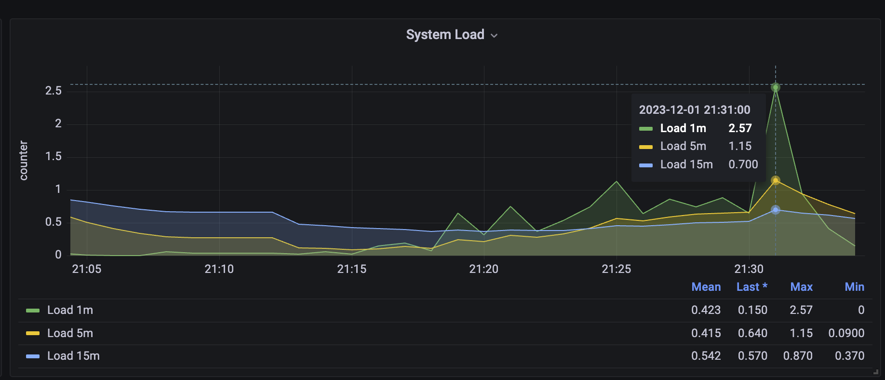


#### Сценарий #2
- - -

Скрипт: **main.js**

Теперь клиенты получают список городов и дергают информацию как о городах (9 штук), так и погоде в них в разные промежутки времен (по 10 запросов для каждого города). Задача не меняется. Ищем максимальное количество пользователей, которое может выдержать наш сервис при таком сценарии не нарушая SLI.

**Результат**: 
- 1.2k VU;
- 1.13k/s запросов;
- Среднее время ответа: 91ms

Уперлись в CPU подов и один из подов перед увеличением латенси прибавил +30 мегабайт к памяти как будто произошла учетка памяти.

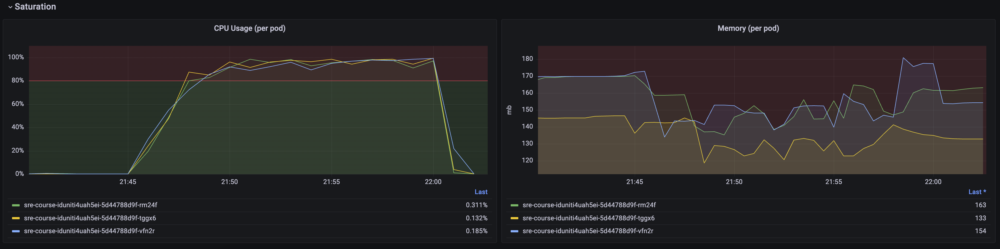

Также был кратковременный скачок минутного LA в +- середине теста, который быстро устаканился:

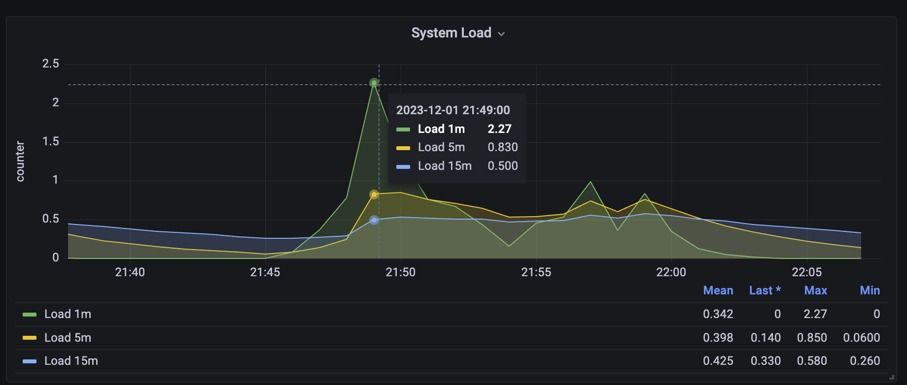

По результатам обоих сценариев можно сделать вывод, что узкое горлышко у нас ресурсы (CPU) подов. В целом также стабильно держится память, которую съели процессы. Очень похоже на утечку.

#### Сценарий #3
- - -

Скрипт: **main.js**

За основу берем сценарий #2. Но теперь мы начинаем пополнять наш сервис и уже существующие в нем города новыми погодными данными. 100 модераторов добавляет по три (3) значения погоды в каждый из 9 городов каждые 30 секунд каждый. Задача не меняется. Ищем максимальное количество пользователей, которое может выдержать наш сервис при таком сценарии не нарушая SLI.

**Результат**: 
- 1.1k VU;
- 1.07k/s запросов;
- Среднее время ответа: 100ms

Результаты практически ничем не отличаются от предыдущих тестов. Добавление погоды никак не сказывается на производительности. За время теста было добавлено 48 236 значений погоды.

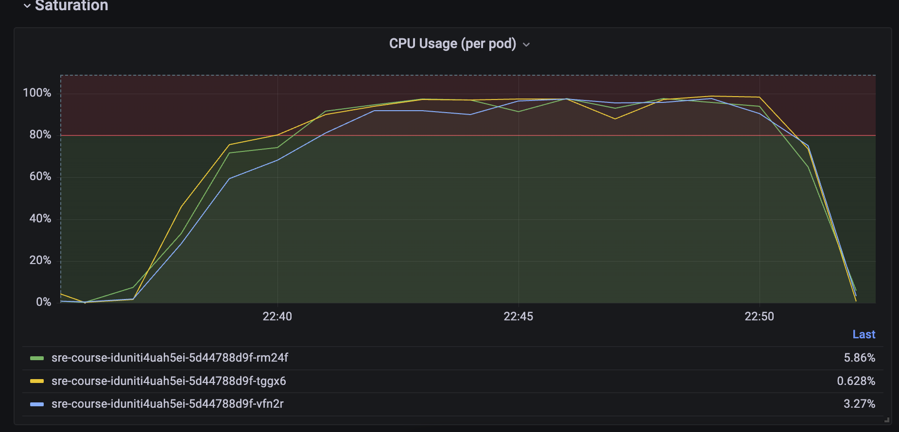

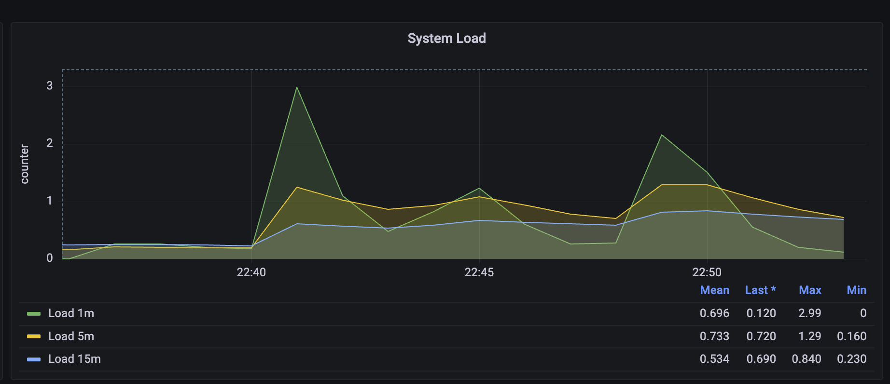

#### Сценарий #4
- - -

Скрипт: **main.js**

За основу берем сценарий #2 и #3. Но с этого момента наш сервис начинает расширяться и мы начинаем так же добавлять новые города и погодные данные в них. 100 модераторов добавляет по три (3) значения погоды в каждый из городов каждые 30 секунд каждый. Другие же 10 модераторов каждые 60 секунд добавляют по одному новому городу каждый.
Задача не меняется. Ищем максимальное количество пользователей, которое может выдержать наш сервис при таком сценарии не нарушая SLI.

**Результат**: 
- 1.2k VU;
- 1.06k/s запросов;
- Среднее время ответа: 116ms

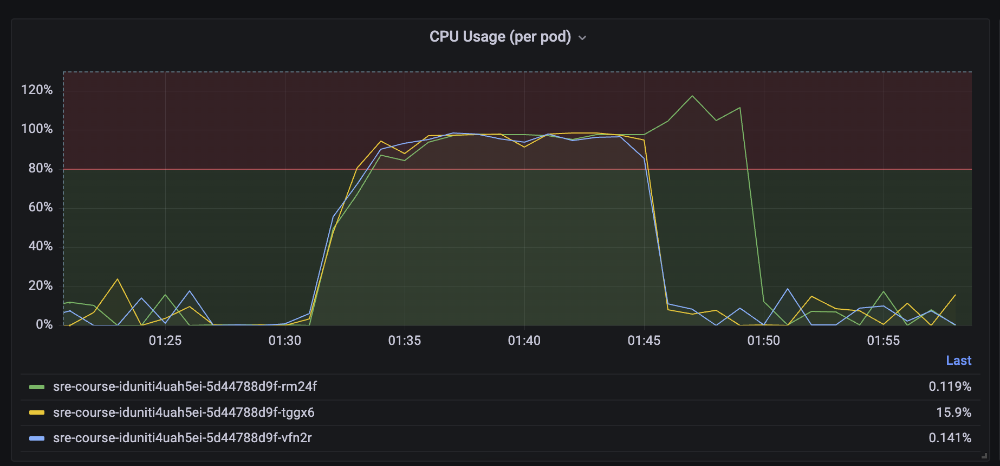

На этот раз также отчетливо появилась деграция по LA у PostgreSQL

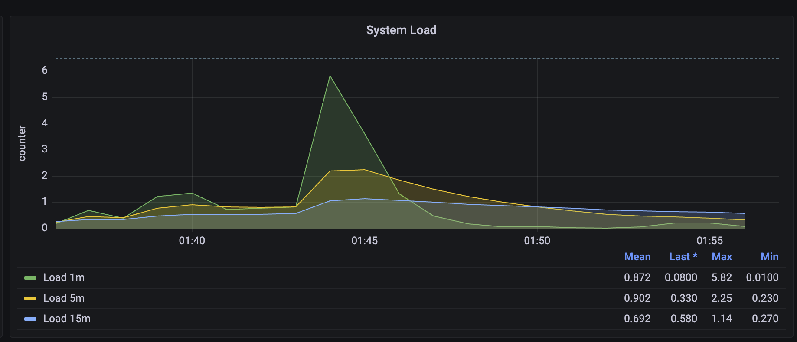

В целом стабильная точка с этим сценарием обнаружена примерно на 783 пользователях.

База данных погоды получила 120 896 значений.
База данных городов получила 189 значений.

#### Сценарий #5
- - -

Скрипт: **heavy_query.js**

Тестируем тяжелый запрос /WeatherForecast. Ищем максимальное количество пользователей, которое может выдержать наш сервис при таком сценарии не нарушая SLI.

Начинаем вход с 0 пользователей и увеличиваем их количество на 600 каждые 5 минут в течении 5 минут.

Тестируем в два прохода:

- С базовой БД описанной в «Описание сервиса»:
  - 9 городов;
  - 750 значений погоды;
  Результат:
  - 119 VU;
  - 99.35/s запросов;
  - Среднее время ответа: 95ms.
  Запрос на практически пустой базе генерирует большое количество транзакций в БД:
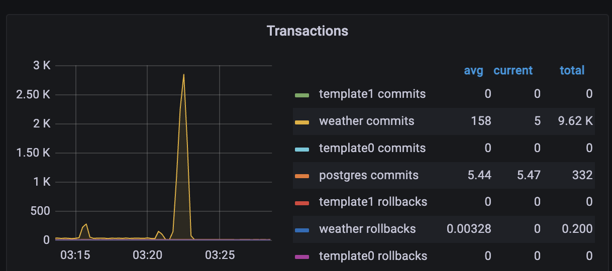
- С БД, наполненной данными от сценария 4 :
  - 120 896 значений погоды;
  - 189 городов;
  Результат: данный запрос является неоптимизированным и с таким количество данных выполняется дольше, чем за время в рамках SLO. Запуск теста сразу же проваливается. Ниже скриншот с ингресса и проверок блэкбокса. Данный запрос проходится по всем городам, забирает все погодные значения и вываливает их в один большой JSON.

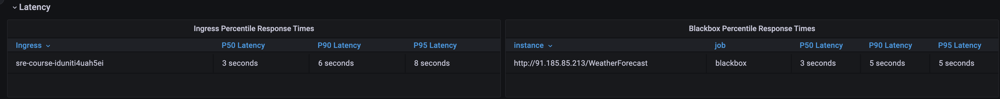


### Результат
- - -

При заложенных в тест данных и использовании сценария #4, который отражает реальное использование сервиса, количество одновременных пользователей, которые могут использовать сервис в рамках SLA составляет около 750 человек. Запрос из сценария #5 неэффективен и не рекомендуется к использованию в его текущем виде. Также стоит обратить внимание, что основное узкое место - это ресурсы подов (в них упираются все сценарии). Также скорей всего настоящий сценарий использования будет не такой нагруженный. На выходе мы получили слишком много данных в БД. Рекомендуется пересмотреть кейс использования сервиса и провести повторные тесты. Скорей всего при текущих ресурсах и более реальном кейсе использовании мы сможем получить x2 или более одновременных пользователей сервиса.

Провел еще один тест со сценарием #5, но количество модераторов, которые добавляют погодные данные снизил со 100 до 10. Получились следующие результаты:

- 1.2k VU;
- 1.09k/s запросов;
- Среднее время ответа: 102ms

Как обычно, уперлись в ресурсы подов.

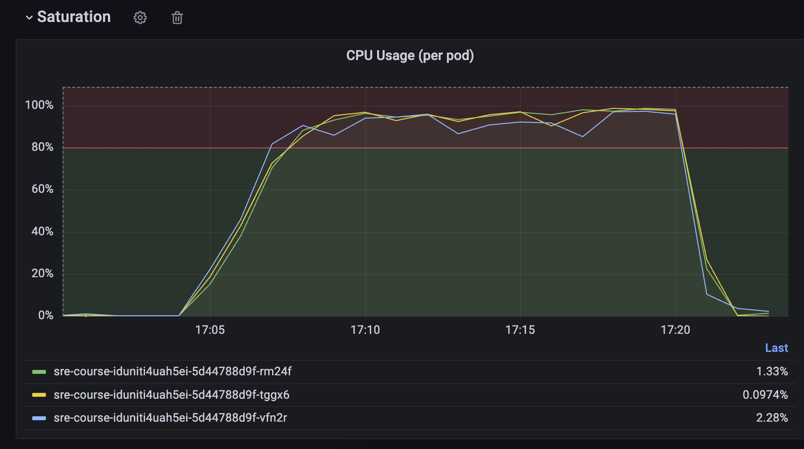

Но на этот раз БД держит уже нормальную нагрузку.

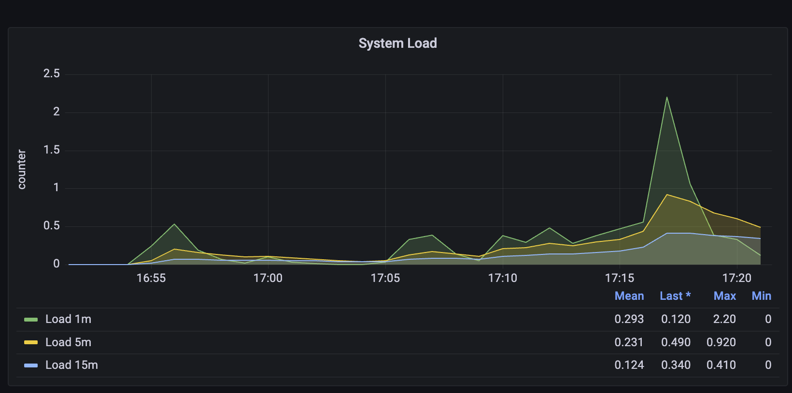

По итогу получается, что это оптимальный сценарий использования.

Примерно 1100 пользователей сервиса и наш сервис расширяется (10 модераторов, которые добавляют погодные данные и 10 модераторов, которые добавляют новые города)

Было добавлено: 

- 189 городов;
- 13 931 значений погоды.
