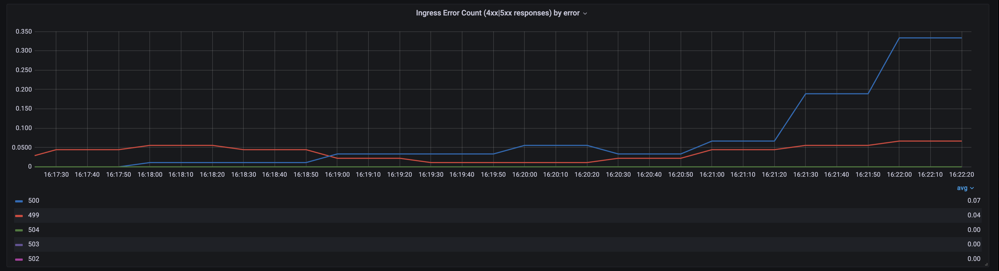

## Виртуальные машины
---

Развернуто 7 (через техническую поддержку была увеличена квота, по умолчанию 5) виртуальных машин (VM) со следующими характеристиками: **2 CPU / 2 RAM / 20 SSD** кроме Prometheus.

Список VM:

- haproxy - HAProxy;
- pg-01 - PostgreSQL + Patroni;
- pg-02 - PostgreSQL + Patroni;
- etcd-01 - etcd;
- etcd-02 - etcd;
- etcd-03 - etcd;
- prometheus - prometheus - **4 CPU / 4 RAM / 20 SSD**.

Для каждой VM создан снапшот, чтобы можно было тратить меньше времени на ее пересоздание в случае необходимости.

Все VM объединены одной виртуальной сетью.

Правила Firewall для виртуальной сети:

По умолчанию: Reject

Разрешены все протоколы и порты для:

- Home;
- Kubernetes;
- Внутренняя сеть;
- Внешние адреса VM;
- Доступ к Prometheus для всех по авторизации.

У всех VM есть внешний адрес, но так как судя по всему используется NAT 1:1, то Firewall виртуальной сети функционирует и тут.

Внешние адреса используется для того, чтобы попадать на хосты по SSH для возможной отладки и в случае HAProxy, чтобы открыть доступ Kubernetes.


## PostgreSQL / Patroni / etcd / HAProxy
---


### Ansible
- - -

За основу была взята роль Ansible postgresql_cluster из репозитория https://github.com/vitabaks/postgresql_cluster из который удалены хвосты GitHuh, Molecule и файлы Consul.

Роль не подразумевает использования публичных адресов (да и при NAT 1:1 работать не будет, потому что адреса в хостах биндятся на интерфейс), поэтому при запуске инсталляции с ноутбука сперва создается туннель до VM с HAProxy при помощи sshuttle, чтобы получить доступ ко внутренней сети VM.

В роль добавлены:

- Добавление адреса HAProxy через переменную cluster_ip в pg_hba.conf;
- Создание БД в процессе установки и загрузка в нее SQL-дампа: roles/postgresql-databases/ с нужными базами, таблицами, 10 городами и рандомно генерируемыми данными по температуре.

После первой установки необходимо в inventory поменять флаг `postgresql_exists` в true у `хостов` в группах `[master]` и `[replica]`, чтобы не получить ошибку при перенакатке роли.

Адрес со статистикой HAProxy: [Statistics Report for HAProxy](http://haproxy:7000/stats)


## Weather API
---


### Helm
- - -

В Helm Chart добавлен хак с `rollme: {{ randAlphaNum 5 | quote }}` для пересоздания подов после каждого `upgrade`. В Helm Chart созданном через `create` она добавляется в зависимость от `podAnnotations`. Вырезать ее не стал, просто добавил заглушку.

Итоговое приложение находится по адресу:  http://iduniti4uah5ei.local/


### Prometheus / Exporters / Grafana
- - -

Prometheus установлен вручную на отдельной виртуальной машине.

Установлена авторизация по логину/паролю и добавлен самоподписанный сертификат.

Включен `enable-admin-api` для доступ к API для управления данными через `curl`

Storage retention выставлен в 90 дней.

Метрики:

- Prometheus;
- node_exporter;
  - Хосты разделены по группам при помощи меток;
- patroni_exporter;
  - Добавлена метка service_name для отображения селектора и имени в дашборде;
- etcd_exporter;
- postgresql_exporter;
- blackbox_exporter (сам blackbox и его метрики);
- alertmanager (сам alertmanager и его метрики).

Используемые шаблоны Grafana:

- [Node Exporter Full  | Grafana Labs](https://grafana.com/grafana/dashboards/1860-node-exporter-full/)
  - Внесены изменения для корректного отображения групп хостов;
  - На экспортерах включены коллекторы `systemd` и `processes` для корректной работы дашборда;
- [PostgreSQL Patroni | Grafana Labs](https://grafana.com/grafana/dashboards/18870-postgresql-patroni/)
- [Etcd by Prometheus | Grafana Labs](https://grafana.com/grafana/dashboards/3070-etcd/)
  - Немного странный шаблон, либо же я не разобрался, так как сразу в глаза бросилась странная метрика `The total number of failed proposals seen`, которая показывала `1`. Оказалось, что она смотрит на counter `etcd_server_leader_changes_seen_total`. Поменял на `etcd_server_proposals_failed_total`.
- [PostgreSQL Database | Grafana Labs](https://grafana.com/grafana/dashboards/9628-postgresql-database/)
  - datasource ограничен одним источником;
  - Судя по всему дашборд достаточно старый, так как многие счетчики в дашборде не соответствуют своим названиям (например в pg_stat_bgwriter_*, в них добавлен префикс _total);
- [Alertmanager | Grafana Labs](https://grafana.com/grafana/dashboards/9578-alertmanager/)
  - Убраны ненужны графики;
- [Prometheus Blackbox Exporter | Grafana Labs](https://grafana.com/grafana/dashboards/7587-prometheus-blackbox-exporter/)
  - Добавлен график Response Code.
- 4 Golden Signals

Адрес с Prometheus: https://prometheus:9090/

### Ansible
- - -

Для node_exporter была сделана роль prometheus_node_exporter, который устанавливает и запускает node_exporter с авторизацией и коллекторами systemd, processes и filesystem.ignored-mount-points.

Для postgresql_exporter была сделана роль prometheus_postgresql_exporter, который устанавливает и запускает postgresql_exporter с авторизацией и коллектором postmaster.


## НТ
- - -

Используется k6: [grafana/xk6-dashboard: A k6 extension that enables creating web based metrics dashboard for k6](https://github.com/grafana/xk6-dashboard)

### Описание сервиса
- - -

Для примера, предположим, что наш сервис предоставляет сервис погоды для золотого кольца России:

- Сергиев Посад
- Переславль-Залесский
- Ростов Великий
- Углич
- Ярославль
- Кострома
- Иваново
- Суздаль
- Владимир

База заполнена автоматически генерируемыми данными (720 случайных значений) погоды за промежуток в 10 дней от даты генерации.


### Ресурсы сервиса
- - -

В первом разделе «Виртуальные машины» есть список и характеристики всех VM. Backend крутится в Kubernetes и представляет собой Blackbox.

Ресурсы Kubernetes (3 реплики):
```
  limits:
    cpu: 250m
    memory: 128Mi
  requests:
    cpu: 50m
    memory: 64Mi
```

k6 установлен на сервере с Prometheus.

### API сервиса
- - -

Имеется доступ к Swager: [Swagger UI](http://iduniti4uah5ei.local/swagger/index.html)

Есть два высоконагруженных метода GET /Forecast и /WeatherForecast, которые отдают список со всеми городами и значения всех температур в них. Методы практически идентичны друг другу (крохотное отличие в структуре отдаваемого JSON).

Остальные методы:

- Cities
  - GET /Cities - список всех городов
  - GET /Cities/{id} - конкретный город
  - PUT /Cities/{id} - изменить название конкретного города
  - POST /Cities - добавить новый город
- Forecast
  - GET /Forecast/{id} - значение погоды (пригодно разве что для теста, чтобы дергать случайные значения)
  - PUT /Forecast/{id} - изменить конкретную погоду
  - POST /Forecast/{cityId} - добавить новое значение погоды для конкретного города


### Требования  к доступность и производительности
- - -

Будем равняться на доступностью такого монстра как OpenWeather для бесплатного использования, их SLA 95%

- SLO/SLA:
  - 90% (изменено, описание ниже
    - время ответа (P95) - не более 600ms
    - время ответа (P90) - не более 300ms;
    - не более 1% ошибок (код ответа <> 200-299).
- SLI:
  - время ответа;
  - процент ошибок.

> В секцию thresholds добавлен checks: ['rate>0.9’] для SLO/SLA 90%, так как мы допускаем что другие коллеги будут запускать свои нагрузочные тесты параллельно с нами, а Kubernetes-ресурсы у нас общие. Спустя какое-то время стало понятно, что найти большое свободное окно для нагрузочных тестов очень трудно, так что пришлось убрать из планов прогон с разными ресурсами подов. Лимиты подов на CPU увеличены со 100 до 250, а памяти со 128 до 256. Время прогона тестов тоже пришлось сократить. Количество возрастающих пользователей пришлось увеличить со 100 до 600.

Даже в 2 часа ночи можно наблюдать как чужие тесты грузят ингресс.


### Профили нагрузки
- - -

Репорты по сценариям лежат в папке **k6/reports/**


#### Сценарий #1
- - -

**main.js**

Клиент получает список городов (9 штук) и дергает информацию по каждому из них по отдельности. Пусть наш API ограничен по скорости принятия запросов от каждого клиента (2r/s). Начинаем вход с 0 пользователей и увеличиваем их количество на 600 каждые 5 минут в течении 5 минут. Задача найти максимальное количество пользователей, которое может выдержать наш сервис при таком сценарии не нарушая SLI.

**Результат**: 
- 1.2k VU;
- 1.17k/s запросов;
- Среднее время ответа: 103ms

Уперлись в CPU подов:


Так же был кратковременный скачок минутного LA PostgreSQL:


#### Сценарий #2
- - -

Скрипт: **main.js**

Теперь клиенты получают список городов и дергают информацию как о городах (9 штук), так и погоде в них в разные промежутки времен (по 10 запросов для каждого города). Задача не меняется. Ищем максимальное количество пользователей, которое может выдержать наш сервис при таком сценарии не нарушая SLI.

**Результат**: 
- 1.2k VU;
- 1.13k/s запросов;
- Среднее время ответа: 91ms

Уперлись в CPU подов и один из подов перед увеличением латенси прибавил +30 мегабайт к памяти как будто произошла учетка памяти.


Также был кратковременный скачок минутного LA в +- середине теста, который быстро устаканился:


По результатам обоих сценариев можно сделать вывод, что узкое горлышко у нас ресурсы (CPU) подов. В целом также стабильно держится память, которую съели процессы. Очень похоже на утечку.


#### Сценарий #3
- - -

Скрипт: **main.js**

За основу берем сценарий #2. Но теперь мы начинаем пополнять наш сервис и уже существующие в нем города новыми погодными данными. 100 модераторов добавляет по три (3) значения погоды в каждый из 9 городов каждые 30 секунд каждый. Задача не меняется. Ищем максимальное количество пользователей, которое может выдержать наш сервис при таком сценарии не нарушая SLI.

**Результат**: 
- 1.1k VU;
- 1.07k/s запросов;
- Среднее время ответа: 100ms

Результаты практически ничем не отличаются от предыдущих тестов. Добавление погоды никак не сказывается на производительности. За время теста было добавлено 48 236 значений погоды.


#### Сценарий #4
- - -

Скрипт: **main.js**

За основу берем сценарий #2 и #3. Но с этого момента наш сервис начинает расширяться и мы начинаем так же добавлять новые города и погодные данные в них. 100 модераторов добавляет по три (3) значения погоды в каждый из городов каждые 30 секунд каждый. Другие же 10 модераторов каждые 60 секунд добавляют по одному новому городу каждый.
Задача не меняется. Ищем максимальное количество пользователей, которое может выдержать наш сервис при таком сценарии не нарушая SLI.

**Результат**: 
- 1.2k VU;
- 1.06k/s запросов;
- Среднее время ответа: 116ms


На этот раз также отчетливо появилась деграция по LA у PostgreSQL


В целом стабильная точка с этим сценарием обнаружена примерно на 783 пользователях.

База данных погоды получила 120 896 значений.
База данных городов получила 189 значений.


#### Сценарий #5
- - -

Скрипт: **heavy_query.js**

Тестируем тяжелый запрос /WeatherForecast. Ищем максимальное количество пользователей, которое может выдержать наш сервис при таком сценарии не нарушая SLI.

Начинаем вход с 0 пользователей и увеличиваем их количество на 600 каждые 5 минут в течении 5 минут.

Тестируем в два прохода:

- С базовой БД описанной в «Описание сервиса»:
  - 9 городов;
  - 750 значений погоды;
  Результат:
  - 119 VU;
  - 99.35/s запросов;
  - Среднее время ответа: 95ms.
  Запрос на практически пустой базе генерирует большое количество транзакций в БД:

- С БД, наполненной данными от сценария 4 :
  - 120 896 значений погоды;
  - 189 городов;
  Результат: данный запрос является неоптимизированным и с таким количество данных выполняется дольше, чем за время в рамках SLO. Запуск теста сразу же проваливается. Ниже скриншот с ингресса и проверок блэкбокса. Данный запрос проходится по всем городам, забирает все погодные значения и вываливает их в один большой JSON.


**Update от 11 декабря 2023 года:**  Вышла новая версия приложения с более оптимизированным запросом. Прогнал ее с базовой БД и получил прирост со 119 VU до 143 VU, 99.35/s запросов до 114.79/s запросов и средним временем ответа 95ms до 113ms. Положил в репорт с именем scenario-5-11-dec-2023-update.html


### Результат
- - -

При заложенных в тест данных и использовании сценария #4, который отражает реальное использование сервиса, количество одновременных пользователей, которые могут использовать сервис в рамках SLA составляет около 750 человек. Запрос из сценария #5 неэффективен и не рекомендуется к использованию в его текущем виде. Также стоит обратить внимание, что основное узкое место - это ресурсы подов (в них упираются все сценарии). Также скорей всего настоящий сценарий использования будет не такой нагруженный. На выходе мы получили слишком много данных в БД. Рекомендуется пересмотреть кейс использования сервиса и провести повторные тесты. Скорей всего при текущих ресурсах и более реальном кейсе использовании мы сможем получить x2 или более одновременных пользователей сервиса.

Провел еще один тест со сценарием #5, но количество модераторов, которые добавляют погодные данные снизил со 100 до 10. Получились следующие результаты:

- 1.2k VU;
- 1.09k/s запросов;
- Среднее время ответа: 102ms

Как обычно, уперлись в ресурсы подов.


Но на этот раз БД держит уже нормальную нагрузку.


По итогу получается, что это оптимальный сценарий использования.

Примерно 1100 пользователей сервиса и наш сервис расширяется (10 модераторов, которые добавляют погодные данные и 10 модераторов, которые добавляют новые города)

Было добавлено: 

- 189 городов;
- 13 931 значений погоды.


## Chaos Engineering
- - -

> В последние дни наблюдается странная ситуация с сетью виртуальных машин в hub.cloud.mts.ru. Видны нарушения ICMP и возрастают задержки. Писал об этом в Telegram. Из-за этого графики ингресса и blackbox показывают «ошибки» и по ним невозможно нормально ориентироваться по тому, что должно происходить в тестах. Соответственно сценарий k6 тоже постоянно падает с ошибкой времени ответа. Создал тикет в поддержке HS-2850. Ниже немного скриншотов с проблемой:
> 
> 
> 
> 
> 
> **Update**: Проблема с сетью решена. Спасибо технической поддержке МТС.

Эксперименты будут проводиться на сценарии для K6 с constant-vus executor’ом. 20 пользователей обращаются к http://iduniti4uah5ei.local/Cities каждые 0.5 секунды в течении 15 минут.

Скрипт лежит здесь: **k6/chaos.js**


### Отключение узла
- - -


#### Описание эксперимента
- - -

Запускаем сценарий тестирования, ждем 5 минут и планово отправляем в перезагрузку сервер PostgreSQL + Patroni являющийся Master’ом.


#### Ожидаемые результаты
- - -

Роль Master должен подхватить оставшийся сервер PostgreSQL + Patroni. Период переключения может занять некоторое время, во время которого клиенты будут получать ошибки. Возможно снижение производительности системы и как следствие увеличение времени ответа пока новый Master не «прогреется».


#### Реальные результаты
- - -

Перезагрузка была выполнена примерно в 00:00:19. 

Patroni справился с переключением за пару секунд.

```
Dec 10 00:00:19 pg-01 patroni[582]: WARNING:patroni.ha:Request failed to pg-02: GET http://10.0.10.3:8008/patroni (HTTPConnectionPool(host='10.0.10.3', port=8008): Max retries exceeded with url: /patroni (Caused by ProtocolError('Connection ab
orted.', ConnectionResetError(104, 'Connection reset by peer'))))
Dec 10 00:00:19 pg-01 patroni[582]: 2023-12-10 00:00:19,255 WARNING: Request failed to pg-02: GET http://10.0.10.3:8008/patroni (HTTPConnectionPool(host='10.0.10.3', port=8008): Max retries exceeded with url: /patroni (Caused by ProtocolError(
'Connection aborted.', ConnectionResetError(104, 'Connection reset by peer'))))
Dec 10 00:00:19 pg-01 patroni[582]: INFO:patroni.watchdog.base:Software Watchdog activated with 25 second timeout, timing slack 15 seconds
Dec 10 00:00:19 pg-01 patroni[582]: 2023-12-10 00:00:19,349 INFO: Software Watchdog activated with 25 second timeout, timing slack 15 seconds
Dec 10 00:00:19 pg-01 patroni[582]: INFO:patroni.__main__:promoted self to leader by acquiring session lock
Dec 10 00:00:19 pg-01 patroni[582]: INFO:patroni.ha:Lock owner: pg-01; I am pg-01
Dec 10 00:00:19 pg-01 patroni[582]: 2023-12-10 00:00:19,397 INFO: promoted self to leader by acquiring session lock
Dec 10 00:00:19 pg-01 patroni[582]: INFO:patroni.__main__:updated leader lock during promote
Dec 10 00:00:19 pg-01 patroni[582]: 2023-12-10 00:00:19,398 INFO: Lock owner: pg-01; I am pg-01
Dec 10 00:00:19 pg-01 patroni[582]: 2023-12-10 00:00:19,443 INFO: updated leader lock during promote
Dec 10 00:00:19 pg-01 patroni[582]: server promoting
Dec 10 00:00:20 pg-01 patroni[582]: INFO:patroni.ha:Lock owner: pg-01; I am pg-01
Dec 10 00:00:20 pg-01 patroni[582]: INFO:patroni.__main__:no action. I am (pg-01), the leader with the lock
Dec 10 00:00:20 pg-01 patroni[582]: 2023-12-10 00:00:20,623 INFO: no action. I am (pg-01), the leader with the lock
```


По логу HAProxy переключение заняло около 4 секунд. Тут явно виноват интервал проверки **inter 3s**.

```
Dec 10 00:00:20 haproxy haproxy[4572]: 100.66.1.113:45748 [10/Dec/2023:00:00:18.318] master master/pg-02 1/-1/2003 0 SC 13/13/12/1/2 0/0
Dec 10 00:00:20 haproxy haproxy[4572]: 100.66.1.113:11182 [10/Dec/2023:00:00:18.318] master master/pg-02 1/-1/2003 0 SC 12/12/11/0/2 0/0
Dec 10 00:00:21 haproxy haproxy[4572]: Server replicas/pg-01 is DOWN, reason: Layer7 wrong status, code: 503, info: "HTTP status check returned code <3C>503<3E>", check duration: 3ms. 0 active and 0 backup servers left. 0 sessions active, 0 re
queued, 0 remaining in queue.
Dec 10 00:00:21 haproxy haproxy[4572]: Server replicas/pg-01 is DOWN, reason: Layer7 wrong status, code: 503, info: "HTTP status check returned code <3C>503<3E>", check duration: 3ms. 0 active and 0 backup servers left. 0 sessions active, 0 re
queued, 0 remaining in queue.
Dec 10 00:00:21 haproxy haproxy[4572]: proxy replicas has no server available!
Dec 10 00:00:21 haproxy haproxy[4572]: proxy replicas has no server available!
Dec 10 00:00:22 haproxy haproxy[4572]: Server replicas_async/pg-01 is DOWN, reason: Layer7 wrong status, code: 503, info: "HTTP status check returned code <3C>503<3E>", check duration: 2ms. 0 active and 0 backup servers left. 0 sessions active
, 0 requeued, 0 remaining in queue.
Dec 10 00:00:22 haproxy haproxy[4572]: Server replicas_async/pg-01 is DOWN, reason: Layer7 wrong status, code: 503, info: "HTTP status check returned code <3C>503<3E>", check duration: 2ms. 0 active and 0 backup servers left. 0 sessions active
, 0 requeued, 0 remaining in queue.
Dec 10 00:00:22 haproxy haproxy[4572]: proxy replicas_async has no server available!
Dec 10 00:00:22 haproxy haproxy[4572]: proxy replicas_async has no server available!
Dec 10 00:00:24 haproxy haproxy[4572]: Server master/pg-02 is DOWN, reason: Layer4 timeout, check duration: 3001ms. 0 active and 0 backup servers left. 20 sessions active, 0 requeued, 0 remaining in queue.
Dec 10 00:00:24 haproxy haproxy[4572]: Server master/pg-02 is DOWN, reason: Layer4 timeout, check duration: 3001ms. 0 active and 0 backup servers left. 20 sessions active, 0 requeued, 0 remaining in queue.
Dec 10 00:00:24 haproxy haproxy[4572]: proxy master has no server available!
Dec 10 00:00:24 haproxy haproxy[4572]: proxy master has no server available!
Dec 10 00:00:24 haproxy haproxy[4572]: Server master/pg-01 is UP, reason: Layer7 check passed, code: 200, info: "HTTP status check returned code <3C>200<3E>", check duration: 2ms. 1 active and 0 backup servers online. 0 sessions requeued, 0 to
tal in queue.
Dec 10 00:00:24 haproxy haproxy[4572]: Server master/pg-01 is UP, reason: Layer7 check passed, code: 200, info: "HTTP status check returned code <3C>200<3E>", check duration: 2ms. 1 active and 0 backup servers online. 0 sessions requeued, 0 to
tal in queue.
Dec 10 00:00:25 haproxy haproxy[4572]: 100.66.1.113:13858 [10/Dec/2023:00:00:18.349] master master/pg-02 1/-1/7003 0 DC 20/20/19/19/2 0/0
Dec 10 00:00:25 haproxy haproxy[4572]: 100.66.1.113:44581 [10/Dec/2023:00:00:18.421] master master/pg-02 1/-1/7004 0 DC 19/19/18/18/2 0/0 
```

Подробный репорт от k6 лежит тут: **chaos/reports/CE-01.html**

Клиенты стали получать ошибки. Деградации БД не было.


#### Анализ результатов
- - -

Деградации БД в условиях теста не было по причине того, что БД содержит в себе менее 200 записей. Время переключения приемлимое. Можно уменьшить за счет уменьшения интервала проверки серверов в HAProxy.


### Имитация частичной потери сети
- - -


#### Описание эксперимента
- - -

Имитировать возрастающую потерю пакетов на Master и посмотреть что будет происходить у клиентов и когда переключится ли Master.

  `tc qdisc add dev ens160 root netem loss X%`


#### Ожидаемые результаты
- - -

- Увеличение времени ответа, количества ошибок у клиентов и в конце концов переключение Master.


#### Реальные результаты
- - -

- 10% потерь - увеличение времени ответа для отслеживаемого 90% и 95% перцентиля.

- 20% потерь - время ответа продолжает увеличиваться. Ошибок пока нет.

- 30% потерь - время ответа продолжает увеличиваться. Ошибок пока нет.

- 40% потерь - время ответа продолжает увеличиваться. Из-за таймаута в 5 секунд на проверках Blackbox стали появляться ошибки 499 (наша проверка закрыла соединение не дождавшись ответа). Соответственно стали проскакивать алерты на probe и http200.


- 60% потерь - К ошибкам 499 добавились 500 ошибки связанные с таймаутом соединения к БД у самого приложения Weather. Появляются дырки на графиках метрик. Срабатывает slowprobe (5 секундный таймаут) проверка.  Часть проверок постоянно сваливается в статус pending (но до alert не доходит). Patroni же пока не переключил Master.



- 80% потерь - выбор нового Master спустя 20 секунд.
```
Dec 10 17:03:21 pg-02 patroni[577]: INFO:patroni.ha:Lock owner: pg-01; I am pg-02
Dec 10 17:03:21 pg-02 patroni[577]: INFO:patroni.__main__:no action. I am (pg-02), a secondary, and following a leader (pg-01)
Dec 10 17:03:21 pg-02 patroni[577]: 2023-12-10 17:03:21,106 INFO: no action. I am (pg-02), a secondary, and following a leader (pg-01)
Dec 10 17:03:31 pg-02 patroni[577]: INFO:patroni.ha:Lock owner: pg-01; I am pg-02
Dec 10 17:03:31 pg-02 patroni[577]: INFO:patroni.__main__:no action. I am (pg-02), a secondary, and following a leader (pg-01)
Dec 10 17:03:31 pg-02 patroni[577]: 2023-12-10 17:03:31,059 INFO: no action. I am (pg-02), a secondary, and following a leader (pg-01)
Dec 10 17:03:41 pg-02 patroni[577]: INFO:patroni.ha:Lock owner: pg-01; I am pg-02
Dec 10 17:03:41 pg-02 patroni[577]: INFO:patroni.__main__:no action. I am (pg-02), a secondary, and following a leader (pg-01)
Dec 10 17:03:41 pg-02 patroni[577]: 2023-12-10 17:03:41,106 INFO: no action. I am (pg-02), a secondary, and following a leader (pg-01)
Dec 10 17:03:43 pg-02 patroni[577]: WARNING:patroni.ha:Request failed to pg-01: GET http://10.0.10.2:8008/patroni (HTTPConnectionPool(host='10.0.10.2', port=8008): Max retries exceeded with url: /patroni (Caused by ConnectTimeoutError(<urllib3.connection.HTTPConnection object at 0x7fdb241368d0>, 'Connection to 10.0.10.2 timed out. (connect timeout=2)')))
Dec 10 17:03:43 pg-02 patroni[577]: 2023-12-10 17:03:43,376 WARNING: Request failed to pg-01: GET http://10.0.10.2:8008/patroni (HTTPConnectionPool(host='10.0.10.2', port=8008): Max retries exceeded with url: /patroni (Caused by ConnectTimeoutError(<urllib3.connection.HTTPConnection object at 0x7fdb241368d0>, 'Connection to 10.0.10.2 timed out. (connect timeout=2)')))
Dec 10 17:03:43 pg-02 patroni[577]: INFO:patroni.watchdog.base:Software Watchdog activated with 25 second timeout, timing slack 15 seconds
Dec 10 17:03:43 pg-02 patroni[577]: 2023-12-10 17:03:43,430 INFO: Software Watchdog activated with 25 second timeout, timing slack 15 seconds
Dec 10 17:03:43 pg-02 patroni[577]: INFO:patroni.__main__:promoted self to leader by acquiring session lock
Dec 10 17:03:43 pg-02 patroni[577]: INFO:patroni.ha:Lock owner: pg-02; I am pg-02
Dec 10 17:03:43 pg-02 patroni[577]: 2023-12-10 17:03:43,479 INFO: promoted self to leader by acquiring session lock
Dec 10 17:03:43 pg-02 patroni[577]: server promoting
Dec 10 17:03:43 pg-02 patroni[577]: INFO:patroni.__main__:updated leader lock during promote
Dec 10 17:03:43 pg-02 patroni[577]: 2023-12-10 17:03:43,486 INFO: Lock owner: pg-02; I am pg-02
```

Подробный репорт (до 80%) от k6 лежит тут: **chaos/reports/CE-02.html**


#### Анализ результатов
- - -

Текущая конфигурация уверенно переносит 30% потерь. При 40% потерь малая часть клиентов начинает испытывать проблемы, которые решают увеличением таймаута до 5 секунд. При 60% начинает деградировать все, от клиентов до самого приложения. Однако Patroni не реагирует. Это связано с текущими настройками DCS, которые можно поправить для более корректного реагирования (ttl >= loop_wait + 2*retry_timeout).

```
  dcs:
    ttl: 30 - высокое время хранения ключа
    loop_wait: 10 - высокое время ожидания
    retry_timeout: 10
```


### Высокая нагрузка на I/O
- - -


#### Описание эксперимента
- - -

Имитировать возрастающую нагрузку CPU на Master и посмотреть что будет происходить у клиентов и когда переключится ли Master.

`blade create cpu load --cpu-percent X --timeout 300`


#### Ожидаемые результаты
- - -

- Увеличение времени ответа, количества ошибок у клиентов и в конце концов переключение Master.


#### Реальные результаты
- - -
- 30% в течении 120 секунд - никаких эффектов.
  
  
- 50% в течении 120 секунд - никаких эффектов.
  
  
- 70% в течении 120 секунд - никаких эффектов.
  
  
- 90% в течении 120 секунд - микроскопическое увеличение времени ответа для P95 и P90.
  
  
- 100% в течении 120 секунд - более значительное увеличение времени ответа, но тоже не критичное.
  
  


#### Анализ результатов
- - -

Каких-то весомых результатов достичь не удалось. Даже при 100% нагрузке не произошло ни критического увеличения времени ответа, ни переключения Master. Скорей всего это связано с тем, что у нас очень крохотная БД и очень легкие запросы.


### Тестирование систем мониторинга и оповещения
- - -


#### Описание эксперимента
- - -

Проверяем скорость реагирования системы мониторинга.


#### Ожидаемые результаты
- - -

Время реагирования системы мониторинга на различные события в пределах 3 минут.

- На хосте наблюдается высокая нагрузка на CPU;
- На хосте заканчивается память;
- На хосте заканчивается место на диске.


#### Реальные результаты
- - -

- На хосте наблюдается высокая нагрузка на CPU
  `blade create cpu load --cpu-percent 100 --timeout 240`
  Результат: никакой реакции
  
  
- На хосте заканчивается память
  `blade create mem load --mode ram --mem-percent 80 --timeout 240`
  Результат: В 19:08:00 на графиках Grafana видим полку по памяти
  
  Алерт сработал:
  `Dec 10 19:10:32 prometheus alertmanager[2268]: ts=2023-12-10T16:10:32.713Z caller=notify.go:745 level=warn component=dispatcher receiver=web.hook integration=webhook[0] aggrGroup="{}:{alertname=\"NodeExporterHostOutOfMemory\"}`
- На хосте заканчивается место на диске
  `blade create disk fill --path /tmp/WAS --percent 92 --timeout 240`
  Результат: В 19:30:45 на графиках Grafana видим полку по месту
  
  Алерт сработал:
  `Dec 10 19:33:17 prometheus alertmanager[2268]: ts=2023-12-10T16:33:17.715Z caller=notify.go:745 level=warn component=dispatcher receiver=web.hook integration=webhook[0] aggrGroup="{}:{alertname=\"NodeExporterHostOutOfDiskSpace\"}"`


#### Анализ результатов
- - -

Алерт связанный с нагрузкой на CPU не укладывается в тайминг. Причина: заложенное время между pending и firing составляет 10 минут `for: 10m`. Чтобы уложиться в тайминг, время можно уменьшить. Остальные два алерты установлены в `for: 2m`, которые тоже можно уменьшить, чтобы уложиться в еще более малые тайминги.


### Выход из строя кластера etcd
- - -


#### Описание эксперимента
- - -

Один за одним останавливаем сервис etcd на каждой из 3 нод. Проверяем что будет с Patroni.


#### Ожидаемые результаты
- - -

Считаем, что даже несмотря на то, что Patroni увидит то, что кластер etcd исчез - это никак не скажется на работе Patroni и будет зафиксировано его последнее состояние. После восстановления кластера все должно постепенно прийти в норму и не привести к переключению Master.


#### Реальные результаты
- - -

- 1 из 3 etcd-сервисов отключены
  Ловим алерт: «Etcd cluster should have an odd number of members» и соответственно уже получаем unhealthy cluster:
  `10.0.10.4:2379 is healthy: successfully committed proposal: took = 2.11921ms`
  `10.0.10.5:2379 is healthy: successfully committed proposal: took = 3.062929ms`
  `10.0.10.6:2379 is unhealthy: failed to commit proposal: context deadline exceeded`
  `Error: unhealthy cluster`
  Состояние лидера Patroni не меняется:
  
- 2 из 3 etcd-сервисов отключены
  Ловим алерт: «Etcd cluster have no leader», так как мы выключили заодно и etcd, который был лидером и получаем множественные алерты от Patroni. Все наше приложение развалилось и сыпет 500 ошибками (не может достучаться до БД)
  
  HAProxy:
```
Dec 10 20:13:27 haproxy haproxy[13215]: Server master/pg-01 is DOWN, reason: Layer7 wrong status, code: 503, info: "HTTP status check returned code <3C>503<3E>", check duration: 1ms. 0 active and 0 backup servers left. 0 sessions active, 0 requeued, 0 remaining in queue.
  Dec 10 20:13:27 haproxy haproxy[13215]: Server master/pg-01 is DOWN, reason: Layer7 wrong status, code: 503, info: "HTTP status check returned code <3C>503<3E>", check duration: 1ms. 0 active and 0 backup servers left. 0 sessions active, 0 requeued, 0 remaining in queue.
  Dec 10 20:13:27 haproxy haproxy[13215]: proxy master has no server available!
  Dec 10 20:13:27 haproxy haproxy[13215]: proxy master has no server available!
```
	Patroni:
```
Dec 10 20:13:02 pg-01 patroni[573]: 2023-12-10 20:13:02,997 INFO: no action. I am (pg-01), the leader with the lock
Dec 10 20:13:12 pg-01 patroni[573]: INFO:patroni.ha:Lock owner: pg-01; I am pg-01
Dec 10 20:13:16 pg-01 patroni[573]: ERROR:patroni.dcs.etcd:Request to server http://10.0.10.4:2379 failed: ReadTimeoutError("HTTPConnectionPool(host='10.0.10.4', port=2379): Read timed out. (read timeout=3.3332138593335308)")
Dec 10 20:13:16 pg-01 patroni[573]: INFO:patroni.dcs.etcd:Reconnection allowed, looking for another server.
Dec 10 20:13:16 pg-01 patroni[573]: INFO:patroni.dcs.etcd:Retrying on http://10.0.10.5:2379
Dec 10 20:13:16 pg-01 patroni[573]: 2023-12-10 20:13:12,951 INFO: Lock owner: pg-01; I am pg-01
Dec 10 20:13:16 pg-01 patroni[573]: 2023-12-10 20:13:16,292 ERROR: Request to server http://10.0.10.4:2379 failed: ReadTimeoutError("HTTPConnectionPool(host='10.0.10.4', port=2379): Read timed out. (read timeout=3.3332138593335308)")
Dec 10 20:13:16 pg-01 patroni[573]: 2023-12-10 20:13:16,292 INFO: Reconnection allowed, looking for another server.
Dec 10 20:13:16 pg-01 patroni[573]: 2023-12-10 20:13:16,292 INFO: Retrying on http://10.0.10.5:2379
Dec 10 20:13:16 pg-01 patroni[573]: ERROR:patroni.dcs.etcd:Request to server http://10.0.10.5:2379 failed: MaxRetryError("HTTPConnectionPool(host='10.0.10.5', port=2379): Max retries exceeded with url: /v3/lease/keepalive (Caused by NewConnectionError('<urllib3.connection.HTTPConnection object at 0x7f15a6bac8d0>: Failed to establish a new connection: [Errno 111] Connection refused'))")
Dec 10 20:13:16 pg-01 patroni[573]: INFO:patroni.dcs.etcd:Reconnection allowed, looking for another server.
Dec 10 20:13:16 pg-01 patroni[573]: INFO:patroni.dcs.etcd:Retrying on http://10.0.10.6:2379
Dec 10 20:13:16 pg-01 patroni[573]: 2023-12-10 20:13:16,293 ERROR: Request to server http://10.0.10.5:2379 failed: MaxRetryError("HTTPConnectionPool(host='10.0.10.5', port=2379): Max retries exceeded with url: /v3/lease/keepalive (Caused by NewConnectionError('<urllib3.connection.HTTPConnection object at 0x7f15a6bac8d0>: Failed to establish a new connection: [Errno 111] Connection refused'))")
Dec 10 20:13:16 pg-01 patroni[573]: 2023-12-10 20:13:16,293 INFO: Reconnection allowed, looking for another server.
```
Оставшийся в живых etcd:
```
Dec 10 20:06:58 etcd-01 bash[524]: {"level":"warn","ts":"2023-12-10T20:06:58.479041+0300","caller":"rafthttp/stream.go:421","msg":"lost TCP streaming connection with remote peer","stream-reader-type":"stream MsgApp v2","local-member-id":"28cd7332cee13aa8","remote-peer-i
d":"b586ded327f9460d","error":"EOF"}
Dec 10 20:06:58 etcd-01 bash[524]: {"level":"warn","ts":"2023-12-10T20:06:58.480723+0300","caller":"rafthttp/stream.go:421","msg":"lost TCP streaming connection with remote peer","stream-reader-type":"stream Message","local-member-id":"28cd7332cee13aa8","remote-peer-id"
:"b586ded327f9460d","error":"EOF"}
Dec 10 20:06:58 etcd-01 bash[524]: {"level":"warn","ts":"2023-12-10T20:06:58.482051+0300","caller":"rafthttp/peer_status.go:66","msg":"peer became inactive (message send to peer failed)","peer-id":"b586ded327f9460d","error":"failed to dial b586ded327f9460d on stream Msg
App v2 (peer b586ded327f9460d failed to find local node 28cd7332cee13aa8)"}
Dec 10 20:07:00 etcd-01 bash[524]: {"level":"warn","ts":"2023-12-10T20:07:00.493293+0300","caller":"etcdserver/cluster_util.go:288","msg":"failed to reach the peer URL","address":"http://10.0.10.6:2380/version","remote-member-id":"b586ded327f9460d","error":"Get \"http:/
/10.0.10.6:2380/version\": dial tcp 10.0.10.6:2380: connect: connection refused"}
Dec 10 20:07:00 etcd-01 bash[524]: {"level":"warn","ts":"2023-12-10T20:07:00.493346+0300","caller":"etcdserver/cluster_util.go:155","msg":"failed to get version","remote-member-id":"b586ded327f9460d","error":"Get \"http://10.0.10.6:2380/version\": dial tcp 10.0.10.6:238
0: connect: connection refused"}
Dec 10 20:07:00 etcd-01 bash[524]: {"level":"warn","ts":"2023-12-10T20:07:00.809766+0300","caller":"rafthttp/stream.go:223","msg":"lost TCP streaming connection with remote peer","stream-writer-type":"stream Message","local-member-id":"28cd7332cee13aa8","remote-peer-id"
:"b586ded327f9460d"}
Dec 10 20:07:01 etcd-01 bash[524]: {"level":"warn","ts":"2023-12-10T20:07:01.045843+0300","caller":"rafthttp/probing_status.go:68","msg":"prober detected unhealthy status","round-tripper-name":"ROUND_TRIPPER_RAFT_MESSAGE","remote-peer-id":"b586ded327f9460d","rtt":"1.052
491ms","error":"dial tcp 10.0.10.6:2380: connect: connection refused"}
Dec 10 20:07:01 etcd-01 bash[524]: {"level":"warn","ts":"2023-12-10T20:07:01.047006+0300","caller":"rafthttp/probing_status.go:68","msg":"prober detected unhealthy status","round-tripper-name":"ROUND_TRIPPER_SNAPSHOT","remote-peer-id":"b586ded327f9460d","rtt":"682.674µs
","error":"dial tcp 10.0.10.6:2380: connect: connection refused"}
Dec 10 20:07:02 etcd-01 bash[524]: {"level":"warn","ts":"2023-12-10T20:07:02.868012+0300","caller":"rafthttp/stream.go:194","msg":"lost TCP streaming connection with remote peer","stream-writer-type":"stream MsgApp v2","local-member-id":"28cd7332cee13aa8","remote-peer-i
d":"b586ded327f9460d"}
```
**Дальше эксперимент не имеет смысла.**


#### Анализ результатов
- - -

Одна из нод жива, telnet на порт 2379 проходит, однако любое обращение к etcdctl выводит:
```
{"level":"warn","ts":"2023-12-10T20:25:07.962307+0300","logger":"etcd-client","caller":"v3@v3.5.9/retry_interceptor.go:62","msg":"retrying of unary invoker failed","target":"etcd-endpoints://0xc000310a80/127.0.0.1:2379","attempt":0,"error":"rpc error: code = Unknown desc = context deadline exceeded"}
```
Поднимаем еще одну ноду и получаем unhealty кластер, но работающий сервис
```
etcdctl --endpoints=$ENDPOINTS endpoint health
{"level":"warn","ts":"2023-12-10T20:29:10.5157+0300","logger":"client","caller":"v3@v3.5.9/retry_interceptor.go:62","msg":"retrying of unary invoker failed","target":"etcd-endpoints://0xc000310c40/10.0.10.5:2379","attempt":0,"error":"rpc error: code = DeadlineExceeded desc = latest balancer error: last connection error: connection error: desc = \"transport: Error while dialing dial tcp 10.0.10.5:2379: connect: connection refused\""}
10.0.10.4:2379 is healthy: successfully committed proposal: took = 2.83928ms
10.0.10.6:2379 is healthy: successfully committed proposal: took = 3.649498ms
10.0.10.5:2379 is unhealthy: failed to commit proposal: context deadline exceeded
Error: unhealthy cluster
```
Восстановление действительно не привело к переключение Master:
```
Dec 10 20:27:56 pg-01 patroni[573]: 2023-12-10 20:27:56,726 ERROR: Request to server http://10.0.10.4:2379 failed: ReadTimeoutError("HTTPConnectionPool(host='10.0.10.4', port=2379): Read timed out. (read timeout=1.4966992165900592)")
Dec 10 20:27:56 pg-01 patroni[573]: 2023-12-10 20:27:56,726 INFO: Reconnection allowed, looking for another server.
Dec 10 20:27:56 pg-01 patroni[573]: ERROR:patroni.dcs.etcd3:watchprefix failed: ProtocolError("Connection broken: InvalidChunkLength(got length b'', 0 bytes read)", InvalidChunkLength(got length b'', 0 bytes read))
Dec 10 20:27:56 pg-01 patroni[573]: 2023-12-10 20:27:56,732 ERROR: watchprefix failed: ProtocolError("Connection broken: InvalidChunkLength(got length b'', 0 bytes read)", InvalidChunkLength(got length b'', 0 bytes read))
Dec 10 20:27:56 pg-01 patroni[573]: ERROR:patroni.ha:Error communicating with DCS
Dec 10 20:27:56 pg-01 patroni[573]: INFO:patroni.__main__:DCS is not accessible
Dec 10 20:27:56 pg-01 patroni[573]: 2023-12-10 20:27:56,734 ERROR: Error communicating with DCS
Dec 10 20:27:56 pg-01 patroni[573]: 2023-12-10 20:27:56,734 INFO: DCS is not accessible
Dec 10 20:27:56 pg-01 patroni[573]: WARNING:patroni.__main__:Loop time exceeded, rescheduling immediately.
Dec 10 20:27:56 pg-01 patroni[573]: 2023-12-10 20:27:56,736 WARNING: Loop time exceeded, rescheduling immediately.
Dec 10 20:27:56 pg-01 patroni[573]: INFO:patroni.ha:Lock owner: pg-01; I am pg-01
Dec 10 20:27:56 pg-01 patroni[573]: INFO:patroni.watchdog.base:Software Watchdog activated with 25 second timeout, timing slack 15 seconds
Dec 10 20:27:56 pg-01 patroni[573]: 2023-12-10 20:27:56,782 INFO: Lock owner: pg-01; I am pg-01
Dec 10 20:27:56 pg-01 patroni[573]: 2023-12-10 20:27:56,829 INFO: Software Watchdog activated with 25 second timeout, timing slack 15 seconds
Dec 10 20:27:56 pg-01 patroni[573]: INFO:patroni.__main__:promoted self to leader because I had the session lock
Dec 10 20:27:56 pg-01 patroni[573]: 2023-12-10 20:27:56,978 INFO: promoted self to leader because I had the session lock
Dec 10 20:27:56 pg-01 patroni[573]: server promoting
```
А стоило бы пойти в документацию etcd и найти там вот такую статью:
[Frequently Asked Questions \(FAQ\)](https://etcd.io/docs/v3.3/faq/#what-is-failure-tolerance)

Получается, что с нашим размером кластера 3, мы можем позволить себе отвал только одной ноды.
Однако остается еще один вопрос, можно ли что-то сделать с тем, чтобы Patroni как-то фиксировал свое последнее состояние если не мог достучаться до etcd?
В процессе поисков наткнулся на вот такой вариант: [DCS Failsafe Mode — Patroni 3.2.1 documentation](https://patroni.readthedocs.io/en/latest/dcs_failsafe_mode.html). По умолчанию выключен. Пробую включить и повторить эксперимент.
```
+++
@@ -88,3 +88,4 @@
 synchronous_mode_strict: false
 synchronous_node_count: 1
 ttl: 30
+failsafe_mode: true

```
На этот раз если выключить все ноды кластера etcd приложение и БД остаются живы:
```
Dec 10 21:02:17 pg-01 patroni[24771]: INFO:patroni.__main__:continue to run as a leader because failsafe mode is enabled and all members are accessible
Dec 10 21:02:17 pg-01 patroni[24771]: 2023-12-10 21:02:17,765 INFO: continue to run as a leader because failsafe mode is enabled and all members are accessible
Dec 10 21:02:17 pg-01 patroni[24771]: WARNING:patroni.__main__:Loop time exceeded, rescheduling immediately.
```
Инстанс, который был Master’ом им и остался. Включаем все ноды etcd, получаем работающий кластер:
```
root@etcd-01:/home/mifz# etcdctl --endpoints=$ENDPOINTS endpoint health
10.0.10.6:2379 is healthy: successfully committed proposal: took = 2.781103ms
10.0.10.4:2379 is healthy: successfully committed proposal: took = 5.214197ms
10.0.10.5:2379 is healthy: successfully committed proposal: took = 3.268598ms
```
При этом никаких переключений Master по прежнему не было. Наше приложение пережило полный краш etcd и его восстановление без переключений.
```
Dec 10 21:05:19 pg-01 patroni[24771]: INFO:patroni.ha:Got response from pg-02 http://10.0.10.3:8008/patroni: Accepted
Dec 10 21:05:19 pg-01 patroni[24771]: 2023-12-10 21:05:19,533 INFO: Got response from pg-02 http://10.0.10.3:8008/patroni: Accepted
Dec 10 21:05:19 pg-01 patroni[24771]: INFO:patroni.__main__:continue to run as a leader because failsafe mode is enabled and all members are accessible
Dec 10 21:05:19 pg-01 patroni[24771]: 2023-12-10 21:05:19,631 INFO: continue to run as a leader because failsafe mode is enabled and all members are accessible
Dec 10 21:05:19 pg-01 patroni[24771]: WARNING:patroni.__main__:Loop time exceeded, rescheduling immediately.
Dec 10 21:05:19 pg-01 patroni[24771]: 2023-12-10 21:05:19,632 WARNING: Loop time exceeded, rescheduling immediately.
Dec 10 21:05:22 pg-01 patroni[24771]: ERROR:patroni.dcs.etcd:Request to server http://10.0.10.4:2379 failed: MaxRetryError("HTTPConnectionPool(host='10.0.10.4', port=2379): Max retries exceeded with url: /v3/kv/range (Caused by NewConnectionError('<urllib3.connection.HTTPConnection object at 0x7ffbe86f48d0>: Failed to establish a new connection: [Errno 111] Connection refused'))")
Dec 10 21:05:22 pg-01 patroni[24771]: INFO:patroni.dcs.etcd:Reconnection allowed, looking for another server.
Dec 10 21:05:22 pg-01 patroni[24771]: INFO:patroni.dcs.etcd:Retrying on http://10.0.10.6:2379
Dec 10 21:05:22 pg-01 patroni[24771]: 2023-12-10 21:05:22,043 ERROR: Request to server http://10.0.10.4:2379 failed: MaxRetryError("HTTPConnectionPool(host='10.0.10.4', port=2379): Max retries exceeded with url: /v3/kv/range (Caused by NewConnectionError('<urllib3.connection.HTTPConnection object at 0x7ffbe86f48d0>: Failed to establish a new connection: [Errno 111] Connection refused'))")
Dec 10 21:05:22 pg-01 patroni[24771]: 2023-12-10 21:05:22,043 INFO: Reconnection allowed, looking for another server.
Dec 10 21:05:22 pg-01 patroni[24771]: 2023-12-10 21:05:22,043 INFO: Retrying on http://10.0.10.6:2379
Dec 10 21:05:22 pg-01 patroni[24771]: INFO:patroni.dcs.etcd:Selected new etcd server http://10.0.10.6:2379
Dec 10 21:05:22 pg-01 patroni[24771]: 2023-12-10 21:05:22,048 INFO: Selected new etcd server http://10.0.10.6:2379
Dec 10 21:05:22 pg-01 patroni[24771]: ERROR:patroni.dcs.etcd:Failed to get list of machines from http://10.0.10.4:2379/v3: MaxRetryError("HTTPConnectionPool(host='10.0.10.4', port=2379): Max retries exceeded with url: /v3/cluster/member/list (Caused by NewConnectionError('<urllib3.connection.HTTPConnection object at 0x7ffbe870aef0>: Failed to establish a new connection: [Errno 111] Connection refused'))")
Dec 10 21:05:22 pg-01 patroni[24771]: 2023-12-10 21:05:22,048 ERROR: Failed to get list of machines from http://10.0.10.4:2379/v3: MaxRetryError("HTTPConnectionPool(host='10.0.10.4', port=2379): Max retries exceeded with url: /v3/cluster/member/list (Caused by NewConnectionError('<urllib3.connection.HTTPConnection object at 0x7ffbe870aef0>: Failed to establish a new connection: [Errno 111] Connection refused'))")
Dec 10 21:05:22 pg-01 patroni[24771]: INFO:patroni.ha:Lock owner: pg-01; I am pg-01
Dec 10 21:05:22 pg-01 patroni[24771]: INFO:patroni.__main__:no action. I am (pg-01), the leader with the lock
Dec 10 21:05:22 pg-01 patroni[24771]: 2023-12-10 21:05:22,054 INFO: no action. I am (pg-01), the leader with the lock
Dec 10 21:05:29 pg-01 patroni[24771]: INFO:patroni.ha:Lock owner: pg-01; I am pg-01
Dec 10 21:05:29 pg-01 patroni[24771]: INFO:patroni.__main__:no action. I am (pg-01), the leader with the lock
Dec 10 21:05:29 pg-01 patroni[24771]: 2023-12-10 21:05:29,675 INFO: no action. I am (pg-01), the leader with the lock
```

**Но! Согласно документации в случае отсутствия etcd и наличия failsafe режима, Patroni переводит кластер в режим read-only. Это надо иметь ввиду. Наш эксперимент прошел успешно, так как мы только читали из БД. Однако с failsave Patroni может успешно пережить падения двух нод из трех.**
